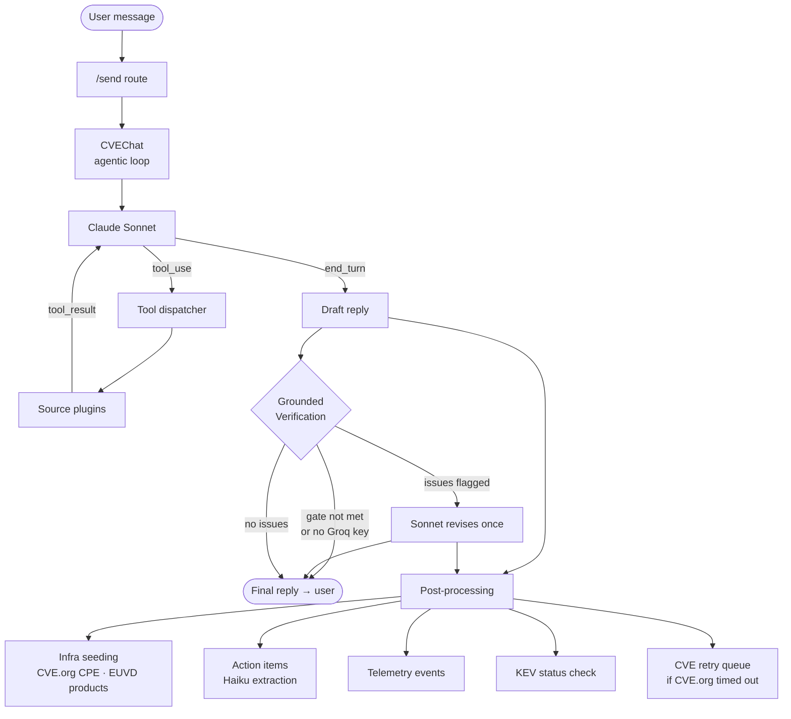
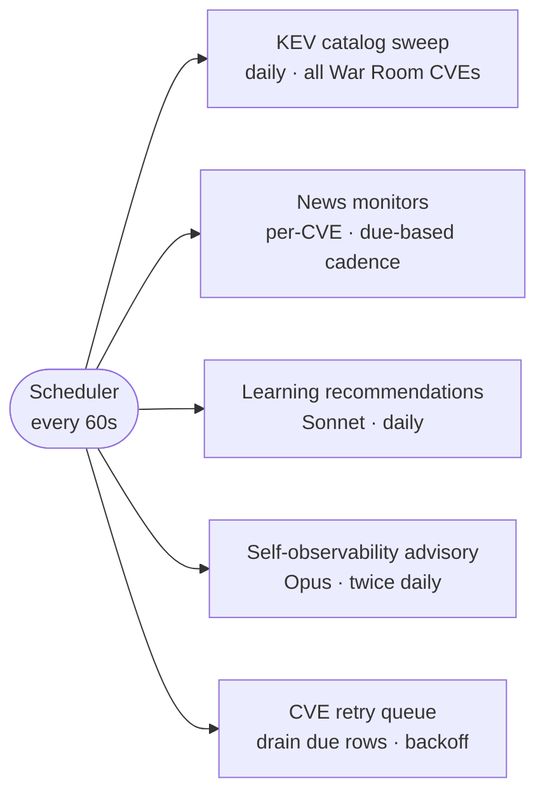

# smashedburger — Architecture

## What it is

smashedburger is a proof-of-concept security consultant agent. The user chats naturally about CVEs and software packages; the agent returns structured briefings — vendor advisories, CVSS analysis, exploit probability, supply-chain compromise verdicts, IOC-backed detection guidance — and passively builds a model of the user's environment as a side-effect of normal use.

It is a single-process Flask application backed by SQLite. There is no message queue, no microservices, no vector database. The entire agent loop — tool dispatch, source assembly, grounded verification, persistence — runs inside one Python process. This was a deliberate PoC simplicity choice.

---

## Features

**CVE analysis**
- Full briefing from a single CVE ID: CVSS score and vector breakdown (v2/v3/v4), EPSS exploit-prediction probability, vendor advisory content, patch versions, workarounds, mitigations, administrative controls, detection guidance
- CVSS cross-validation: CVE.org score vs ENISA EUVD score shown side-by-side; discrepancy badge when they diverge
- CNA attribution (which organisation disclosed the CVE) and CWE root-cause classification from MITRE CVE.org
- Exploit-DB public exploit count — the clearest escalation signal alongside KEV status
- CISA KEV watch: daily sweep flags War Room CVEs as known-exploited or ransomware-associated

**Vendor advisory pipeline**
Structured advisory fetching for Palo Alto Networks, Cisco PSIRT, Fortinet FortiGuard, Citrix, Broadcom/VMware, GitHub Advisory Database, Red Hat, Ubuntu, and Microsoft MSRC. When CVE.org references a vendor URL, the agent picks it up and calls the right fetcher automatically.

**Supply-chain / package analysis**
- OSV.dev query for npm and PyPI packages: vulnerability history, malicious-package records (MAL-prefix / OpenSSF feed), affected version ranges, fixed versions
- Package registry metadata: deprecation flag, last publish date, maintainer count, typosquat detection (404 = package not found)
- Socket.dev supply-chain risk scores: behavioral/static analysis of the artifact currently in the registry — install scripts, eval use, network/filesystem access, obfuscation, maintainer churn
- Exa open-web search for fresh compromise write-ups, vendor advisories, and incident narratives not yet in OSV

**War Room**
A CVE-centric dashboard that survives conversation deletion. Each tracked CVE shows: severity header, CVSS ring, CVE.org vs EUVD cross-validation, CNA/CWE chips, Exploit-DB badge, KEV badge, actionable checklist (patch / workaround / mitigation / admin / detect), IOC list (IPs, domains, hashes, YARA/Sigma rules), per-CVE news monitor, and VirusTotal hash lookups.

**Local Attack Graph**
A D3.js force-directed graph (SVG, no external renderer) built from two data sources: CVE records from the War Room and the infrastructure model. Nodes are typed — CVE, OS, application, library, zone, CWE — each with a semantic colour (CVE severity-driven; zone=amber perimeter; OS=steel blue foundation; app=violet workload; library=indigo dependency chain). Edges are split into two visual tiers: threat edges (`affects`, `threatens`) are vivid and thick; structural edges (`runs_on`, `depends_on`, `hosts`) are muted and thin, so the attack surface stands out from the plumbing. Topology is enriched via a chat input in the graph screen — the user describes relationships in plain language ("Log4j runs inside Tomcat"), which Sonnet parses into relationship records via `/graph-context`. Edge weights are computed structurally: for `root_cause` (CVE→CWE) edges, weight = number of CVEs in the graph that share that weakness class — a heavier edge means fixing that CWE covers more CVEs simultaneously. For `affects` and `threatens` edges, weight comes from the `relationships` table (user-confirmed topology). Edge pixel width is `base + weight × multiplier` (`2.5 + w×3` for affects, `1.5 + w×2` for threatens). Clicking a CVE node triggers a BFS blast-radius pass: non-reachable nodes dim to near-invisible, threat-path edges animate with marching dashes (`stroke-dashoffset` CSS loop) to show propagation direction. CWE node tooltips fetch live descriptions from the MITRE CWE REST API (`cwe-api.mitre.org/api/v1/cwe/weakness/{n}`) proxied through Flask with SQLite caching.

**IOC extraction**
On demand, Exa searches for threat intelligence attributed to a CVE and returns a structured IOC list with source grounding. Each source URL exists because it contributed to an IOC — eliminating cross-CVE reference pollution structurally.

**Infrastructure model**
As conversations happen, vendors and products are passively seeded into a local SQLite model — no prompting required, no LLM involved. Extraction is deterministic: CVE.org CPE fields for analysed CVEs, ENISA product lists for new CVEs not yet scored. The model feeds back into future conversations as environment context.

**News monitoring**
Per-CVE dated news searches via Exa, on a due-based schedule. A word-boundary relevance filter prevents lookalike CVE IDs from polluting the feed. Results appear in the War Room panel.

**Learning recommendations**
Once a day, the agent analyses the user's past conversations, lifts specifics to concept-class level, and surfaces curated educational reading — OWASP articles, PortSwigger guides, FIRST.org documentation — with provenance ("suggested because you explored this in conversation X").

**Self-observability**
Every LLM call, tool call, and HTTP request is instrumented. An advisory pass runs twice a day, reads the aggregated telemetry, and surfaces plain-language suggestions about token usage patterns, failing tools, and cache efficiency.

**Authentication**
Email + password (scrypt). 2FA is a time-limited 6-digit code delivered by email (or printed to the console if SMTP is not configured). Sessions expire after 12 hours. Per-user conversation isolation throughout.

---

## Feature flows

| Feature | Trigger | Flow |
|---|---|---|
| **CVE Briefing** | User sends CVE ID | `/send` → Sonnet agentic loop → `fetch_cve` (CVE.org API) + `query_epss` + vendor advisories → stream reply → Grounded Verification → Haiku action extraction → DB persist |
| **Streaming chat** | Every `/send` | `CVEChat.stream_reply()` generator → yields `("token", chunk)` → SSE to browser → `marked.parse()` on each chunk → `("done", reply)` finalises |
| **Grounded Verification** | Post-reply, auto or on-demand | Groq gpt-oss-120b checks draft vs tool outputs → if flagged → Sonnet revises once → revised reply replaces draft in history |
| **War Room** | CVE conversation exists | `db.store_cve_metadata` during briefing → card shows CVSS, KEV, EUVD cross-validation |
| **CVSS Recheck** | User clicks ↻ in War Room | `POST /cvss-recheck/<cve_id>` → re-fetches CVE.org + EUVD independently → `store_cve_metadata(force=True)` → updates panel |
| **Attack Graph** | User opens graph screen | `GET /graph-data` → War Room CVEs + infra products + relationships → D3 force simulation → nodes coloured by type/severity → click CVE → BFS blast radius → marching-dash animation on threat edges |
| **Graph topology** | User types in graph chat box | `POST /graph-context` → Sonnet parses statement → `store_relationship` or infra upsert → `/graph-data` re-fetched |
| **CWE tooltip** | Hover CWE node in graph | JS calls `GET /cwe/<id>` → SQLite cache hit or MITRE REST API fetch → `{name, desc}` shown in tooltip |
| **Infrastructure discovery** | Ownership language in chat | Sonnet calls `add_to_infrastructure` tool mid-reply → `db.upsert_vendor/product/version` |
| **Auto-infra from CVE** | CVE.org fetch succeeds | CPE products from NVD ADP container inside CVE.org record → `upsert_vendor/product` → `set_relevant_to_infra` |
| **CVE retry queue** | CVE.org times out / 404 | `ctx.cve_retry.cve_id` set → `/send` queues retry → scheduler retries up to 3× with backoff (1 min, 5 min) → on success updates War Room |
| **EUVD fallback** | CVE.org fails, EUVD succeeds | EUVD score seeds War Room via `store_cve_metadata` (COALESCE — CVE.org will overwrite later when retry succeeds) |
| **KEV status** | CVE enters War Room | `monitoring.ensure_kev_status()` → CISA catalog fetch (cached 6h) → `db.upsert_kev_status` → War Room badge |
| **KEV daily sweep** | Scheduler, every 24h | One catalog fetch → checks all War Room CVEs → flags new-in-KEV transitions |
| **News monitoring** | Scheduler, per-CVE cadence | Exa search with date window → word-boundary relevance filter → `db.upsert_monitor_news` |
| **Package analysis** | User asks about npm/pip package | Sonnet calls `query_package_vulns` + `query_package_registry` → compromise check → vulns by severity → health signals |
| **News feed** | Scheduler, daily | RSS/Atom/JSON Feed via feedparser or Exa fallback → `db.replace_news_items` |
| **Learning recommendations** | Scheduler, daily | Sonnet concept-lift over conversation history → weight threshold → Exa dateless educational search → recommendation card |
| **Self-observability advisory** | Scheduler, 2×/day | Telemetry digest → Opus advisory → grounded suggestions → `db.upsert_suggestions` |
| **Action extraction** | Every reply > 300 chars | Haiku decomposes reply into patch/workaround/mitigation/admin/detect items → `db.upsert_candidates` |
| **IOC extraction** | Explicit IOC search | `search_iocs` → VirusTotal + Exa → Haiku structures IOC list |
| **Prefetch** | CVE.org fetch succeeds | gevent greenlets warm EUVD, CVE.org supplementary, Exploit-DB concurrently while Sonnet reasons |
| **Auth / 2FA** | Login | Email + password → 6-digit OTP email → session fixation defence on success → 12h session |
| **Conversation title** | First message in new conv | Haiku generates 4-7 word title → `db.update_title` |

---

## Request flow

## Background scheduler loops

A daemon thread checks every 60 seconds for due work. Scheduling is due-based, not cron: a task is due when `last_run + cadence ≤ now`. If the server was offline past a due time, the task runs once at next startup — no catch-up storm.

---

## Core modules

| Module | Role |
|---|---|
| `main.py` | Flask routes + `/send` orchestration |
| `chat.py` | `CVEChat` — streaming agentic tool-use loop |
| `context.py` | Thread-local per-request state (link/action/infra accumulators) |
| `db.py` | All SQLite CRUD (~20 tables) |
| `extraction.py` | Haiku extraction layer (actions, IOCs, titles) |
| `tools.py` | Raw API implementations (CVE.org, EPSS, advisories, OSV, VirusTotal, Exa) |
| `verification.py` | Grounded verification pass (Groq critic + Sonnet revision) |
| `monitoring.py` | Background scheduler (KEV, news, CVE retry, learning, self-observability) |
| `auth.py` | Authentication Blueprint (register / 2FA / password-reset) |
| `news.py` | RSS/Atom/Exa feed fetcher for the News dashboard |
| `learning.py` | Learning recommendation engine |
| `obs.py` | Self-observability advisory (Opus) |
| `telemetry.py` | Token/cost/latency aggregation |
| `kev.py` | CISA KEV catalog fetcher and lookup |
| `log_config.py` | Centralised logging setup (`LOG_LEVEL` env var, hierarchical loggers) |
| `advisories.py` | Tier-1 parallel advisory fetch (GitHub, Red Hat, Ubuntu, MSRC) |

---

## Source plugin system

Each external data source is a Python module in `sources/`. Every module declares four things:

- `NAME` — the tool name presented to the LLM
- `ORDER` — integer position in the tools list
- `TOOL_DEF` — the Anthropic `ToolParam` schema
- `fetch(**kwargs)` — the callable the dispatcher invokes

The assembler in `sources/__init__.py` auto-discovers modules, sorts by `ORDER`, and wraps every `fetch` in a uniform tracker that captures telemetry, thread-local context (links, actions), and package auto-infra data. The tool with the highest `ORDER` carries the Anthropic prompt-cache breakpoint. To add a source: create a file with the four attributes. To disable one without deleting it: set `ENABLED_SOURCES=name1,name2` in the environment.

| ORDER | Tool | Registered name | Purpose |
|---|---|---|---|
| 10 | `fetch_cve` | `parse_nvd_cve`* | CVE metadata from CVE.org (MITRE), CVSS via NVD ADP container, CPE product list |
| 11 | `fetch_euvd_cve` | `fetch_euvd_cve` | ENISA EUVD — CVSS cross-validation, product fallback |
| 12 | `fetch_cveorg` | `fetch_cveorg` | MITRE CVE.org supplementary — CNA attribution, CWE root-cause |
| 13 | `fetch_exploitdb` | `fetch_exploitdb` | Exploit-DB — public exploit count |
| 20 | `query_epss` | `query_epss` | EPSS exploit-prediction probability |
| 30 | `add_to_infrastructure` | `add_to_infrastructure` | Persist vendor/product to local infra model |
| 40 | `search_cves_by_product` | `search_cves_by_product` | CVE search by product name |
| 50 | `fetch_palo_alto_advisory` | `fetch_palo_alto_advisory` | Palo Alto Networks advisories |
| 60 | `fetch_cisco_advisory` | `fetch_cisco_advisory` | Cisco PSIRT advisories |
| 70 | `fetch_fortinet_advisory` | `fetch_fortinet_advisory` | FortiGuard advisories |
| 80 | `fetch_citrix_advisory` | `fetch_citrix_advisory` | Citrix bulletins |
| 90 | `query_package_vulns` | `query_package_vulns` | OSV package vulnerability lookup |
| 100 | `query_package_registry` | `query_package_registry` | npm / PyPI registry metadata |
| 105 | `fetch_socket_score` | `fetch_socket_score` | Socket.dev supply-chain risk score |
| 106 | `search_package_intel` | `search_package_intel` | Exa open-web package intelligence |
| 110 | `fetch_broadcom_advisory` | `fetch_broadcom_advisory` | Broadcom / VMware advisories |
| 120 | `fetch_advisories` | `fetch_advisories` | Tier-1 parallel fetch (GitHub, Red Hat, Ubuntu, MSRC) — prompt-cache breakpoint |

*The registered name `parse_nvd_cve` is kept so Sonnet's trained tool-calling behaviour is unchanged. The underlying provider is CVE.org (MITRE), not NVD.

---

## Streaming

`CVEChat.stream_reply()` is a Python generator. It yields `("token", chunk)` for each text delta on the final assistant turn, and `("done", full_reply)` once. Tool-use rounds (structured JSON) are blocking — only the final prose turn is streamed.

The Flask `/send` route iterates the generator directly with `for kind, value in chat.stream_reply(msg)` and forwards each token as an SSE event (`text/event-stream`). No greenlet bridge, no polling, no intermediate buffer. Tokens flow: Anthropic SDK → generator → HTTP chunked response → browser.

The browser renders tokens progressively via `marked.parse(accumulated)` on each chunk so partial replies render as formatted markdown, not raw text.

---

## Grounded verification

After Claude drafts a reply, a second model — Groq `openai/gpt-oss-120b` — receives the draft and the exact `tool_result` blocks from the current turn (no re-fetching). It checks whether specific claims in the draft (scores, versions, exploitation status) are supported by the tool outputs and flags contradictions. Claude then revises once.

The topology is: **draft → critique → revise (once)**. A referee model that accepted or rejected the draft outright was explored and rejected — it added latency without improving output quality, and it conflated two separate questions (is the draft faithful to its sources? vs were the sources complete?). Grounded verification only answers the first.

The gate: verification only runs when (a) a grounding tool was called this turn, (b) the reply is ≥ 400 characters, and (c) `GROQ_API_KEY` is set. Short conversational replies and tool-free turns skip silently.

`ask_advisor` (Opus) is explicitly excluded from the GV corpus via `_NON_GROUNDING_TOOLS`. Opus reasoning is not a primary source — GV must not verify Sonnet's reply against it as if it were factual CVE data.

The choice of a different model family (Groq/Qwen vs Anthropic/Claude) is deliberate: models from the same family tend to make the same errors on the same inputs.

---

## Advisor tool (Opus mid-generation consult)

Sonnet has access to `ask_advisor` — a tool it can call mid-generation when the user's question requires reasoning about their specific infrastructure or security posture, rather than generic CVE facts. Typical triggers: "are we exposed?", "which CVE should we patch first?", "given our stack, what's the biggest risk?"

When called, `ask_advisor` sends a plain `messages.create` call to `claude-opus-4-8` (no tools, no agentic loop) with three context blocks: the full conversation history including tool results from this turn, the user's infra snapshot from DB, and the focused question. Opus returns ≤4 sentences of targeted advice. Sonnet incorporates it into its reply and continues.

**Why Opus and not Sonnet itself?** Sonnet is already mid-generation when it calls the advisor. The consult is a deliberate context switch — Opus sees the same data but approaches the synthesis question fresh, without the generation momentum Sonnet has already built up.

**Boundaries:**
- Opus cannot call tools or write to DB — it returns text only. Sonnet remains the orchestrator.
- Capped at 2 calls per turn to control cost.
- `ask_advisor` is in `_NON_GROUNDING_TOOLS` so GV never treats Opus's advice as factual ground truth.
- Haiku extracts action items from Sonnet's final reply, which incorporates Opus's advice naturally — no special handling needed.

The conversation history is passed as a live reference (`ctx.conv_messages.messages`) set at request start. Tool results appended earlier in the same turn are visible to Opus because Sonnet executes tools sequentially — by the time `ask_advisor` fires, all prior tool results are already in the list.

Advisor calls are tracked in telemetry (`kind=tool`, `name=ask_advisor`) and surfaced as a dedicated "⬡ opus consults" tile in the OBS screen. A purple `⬡ Opus` badge appears on messages where the advisor was consulted.

---

## Haiku extraction layer

A silent post-processing pass runs `claude-haiku-4-5` after the final reply is produced. It handles two tasks:

**Action items.** Source modules that define `extract_actions(result)` return advisory text blobs alongside any structured actions they parsed directly. Haiku decomposes the blobs into discrete checklist items — patch steps, workarounds, configuration changes — each tagged with its source and type (`patch` / `workaround` / `mitigation` / `admin` / `detect`). These surface as candidates in the Checklist screen.

**Conversation titles.** On the first turn of a new conversation, Haiku generates a short title from the user's opening message.

Both calls are spawned as `gevent.spawn` greenlets immediately after GV completes and joined before their results are consumed. This means the two Haiku HTTP round-trips overlap with the synchronous CVE/product DB writes that follow GV, reducing post-stream latency from `actions_time + title_time` to `max(actions_time, title_time)`. The same cooperative greenlet model applies here as elsewhere: native OS threads must not be used inside a gevent worker (they stall the hub).

Haiku is used instead of Sonnet for these tasks because they are high-volume, latency-sensitive, and structurally simple — JSON list output with no reasoning required. Failures return `[]` silently; a dead greenlet's `.value` is consumed via `is not None` identity checks, not truthiness (dead greenlets are falsy in gevent).

What Haiku does **not** do: infrastructure extraction is deterministic structured parsing (CVE.org CPE fields + EUVD product arrays). No LLM is involved in the infra pipeline.

---

## Self-observability loop

Token counts, latency, and tool call outcomes are recorded at three instrumentation points: every LLM call (Sonnet and Haiku), every tool call (via the plugin wrapper), and every HTTP request. These land in an append-only `telemetry_events` table.

Twice a day, an Opus advisory pass reads an aggregated digest of the last 7 days and surfaces plain-language suggestions — e.g. "tool X is failing 30% of the time", "cache read ratio is below the expected baseline". Suggestions are deduplicated by a canonical issue key so the same advice never re-surfaces after being dismissed.

Cost is computed at read time from token counts and a config price table, never stored — so a price change re-prices the entire history for free.

---

## Learning loop

Once a day, a Sonnet pass analyses all of a user's past conversations and lifts surface-level specifics to concept-class level. Two conversations about different TLS appliance CVEs become the concept "Memory disclosure in TLS/VPN appliances". Concepts are weighted by recurrence and question-asking intent.

For concepts above the weight threshold, an open-web dateless Exa search surfaces educational reading — OWASP, PortSwigger, FIRST.org, Snyk Learn — with provenance: the user sees "suggested because you explored this in [conversation title]". A taught concept is never re-surfaced after the user marks it done.

Key design choices:
- **Dateless search** — canonical educational content is not time-sensitive; dating the query degrades it to CVE-specific blog posts
- **One Sonnet call per daily run** — quality over cost
- **Global sentinel** — the daily run covers all conversations; it is not per-user

---

## CVE retry queue

CVE.org is the authoritative CVE source but has no SLA. When a fetch fails during a request, the CVE is inserted into the `cve_retry_queue` table with a backoff schedule (1 min → 5 min → give up after 3 attempts). The background scheduler drains due rows every 60 seconds. EUVD fills the score immediately via COALESCE so the War Room card is not blank while the retry is pending — CVE.org will overwrite it when the retry succeeds.

Even when CVE.org times out, EUVD, the supplementary CVE.org record, and Exploit-DB still run — the briefing remains substantive.

---

## Infrastructure model

As conversations happen, vendors and products are passively discovered and stored in a local hierarchy (`infra_vendors` → `infra_products` → `infra_versions`). The user never has to populate this manually. Extraction is fully deterministic — no LLM:

1. **CVE.org CPE fields** (`cpe:2.3:<type>:<vendor>:<product>:...`) parsed from the NVD ADP container inside the CVE.org record
2. **EUVD `enisaIdProduct[]`** entries from the ENISA API, used when CPE data is absent (common on new CVEs not yet enriched)

The infra model is fed back into the system prompt for future conversations so the agent cross-references new CVEs against what it already knows about the user's environment.

Vendor names are normalised before hashing (Google LLC → Google) to prevent duplicates. IDs are deterministic `uuid5` values — the same vendor always gets the same row.

---

## Session security

- **Session expiry**: `PERMANENT_SESSION_LIFETIME = 12h`. `session.permanent = True` set on login.
- **Session fixation defence**: `session.clear()` is called before writing `user_id` after 2FA succeeds — a pre-planted session ID cannot be promoted to authenticated.
- **2FA brute-force**: attempt counter in the signed session cookie (client cannot tamper). After 5 wrong attempts the session is cleared and login must restart.
- **`SECRET_KEY` required**: app raises `RuntimeError` at startup if unset. A random fallback would silently invalidate all sessions on restart.
- **Secure cookies**: `SESSION_COOKIE_SECURE` defaults to `True`. Set `SECURE_COOKIES=0` in `.env` for local HTTP dev.

---

## Structured logging

All modules use `logging.getLogger(__name__)`, giving a hierarchy of logger names (`smashedburger.main`, `smashedburger.sources.nvd`, etc.) that can be silenced independently. `log_config.py` is called once at startup.

An `@app.after_request` hook in `main.py` logs every HTTP request — method, path, status code, and duration — automatically. `/healthz` and `/static/` are excluded. This covers all 40+ routes with no per-function instrumentation.

Log levels are used deliberately:
- `DEBUG` — per-call detail (tool inputs/outputs, CVE.org fetch, KEV checks). Off in production.
- `INFO` — per-request outcomes (HTTP access log, Sonnet timing, GV result, Haiku action count, auth events).
- `WARNING` — recoverable failures (CVE.org miss queued for retry, feed failure, 2FA lockout, login failure).
- `ERROR` — unrecoverable failures (Haiku gave up after double retry, scheduler crash).

Set `LOG_LEVEL=DEBUG` locally; leave unset on Fly.io (defaults to `INFO`).

---

## Fault tolerance

**Source modules** all set an explicit HTTP timeout and catch broadly, returning `{"found": False}` on any failure. A missing advisory degrades the reply but never crashes the request. `euvd`, `exploitdb`, and `cveorg` log at WARNING on HTTP 429/503 (rate-limited or server error) and DEBUG on other non-200s, making API degradation visible in `fly logs` without changing behaviour. The distinction between "CVE not in database" and "API is down" is not surfaced to the Sonnet caller — both look the same — which is acceptable for a single-user tool.

**`db.append_message`** is wrapped in try/except with a WARNING log. A failed persist means in-memory history diverges from the DB (messages appear in the current session but are lost after restart). The WARNING in `fly logs` makes this detectable.

**GV (Groq)** has a 429 backoff loop and a 60s timeout, plus a circuit breaker: after 3 consecutive failures `is_available()` returns `False` and GV is skipped for 300s, preventing 60s hangs on every user turn when Groq is down. After the cooldown the breaker moves to half-open (one probe attempt) before fully resetting. State is in-memory only — a process restart resets it, which is correct (a fresh deploy should retry rather than inherit a tripped breaker from a previous outage).

**Scheduler** catches at the iteration level — one failed poll or retry job cannot kill the loop.

---

## Persistence

Single SQLite file. Schema is created in full via `CREATE TABLE IF NOT EXISTS` on startup. Incremental column additions use `ALTER TABLE ADD COLUMN` inside a `try/except` — idempotent since SQLite raises on duplicate columns. No migrations framework.

Key design: the `cve_records` table is keyed by `cve_id`, not `conversation_id`. CVE intelligence (CVSS scores, CNA, CWE, Exploit-DB count) survives conversation deletion. The War Room is CVE-centric, not conversation-centric.

---

## External services

| Service | Purpose | Key |
|---|---|---|
| Anthropic Claude (Sonnet / Haiku / Opus) | Reasoning, extraction, advisory | `ANTHROPIC_API_KEY` |
| MITRE CVE.org | Primary CVE source — metadata, CVSS (via NVD ADP), CPE products | — |
| ENISA EUVD | EU vulnerability database — CVSS cross-validation and score fallback | — |
| Exploit-DB | Public exploit count per CVE | — |
| FIRST.org EPSS | Exploit prediction probability | — |
| CISA KEV catalog | Daily sweep for known-exploited status | — |
| Exa AI | IOC search, dated news monitoring, learning-rec search, package intel | `EXA_API_KEY` |
| Groq (`gpt-oss-120b`) | Grounded verification critic | `GROQ_API_KEY` (optional) |
| VirusTotal | File hash lookups | `VIRUSTOTAL_API_KEY` (optional) |
| Socket.dev | Package supply-chain risk scores | `SOCKET_API_KEY` (optional) |
| OSV (osv.dev) | Package vulnerability data (npm, PyPI) | — |
| npm / PyPI registries | Package metadata, deprecation, maintainer count | — |
| GitHub Advisory Database | CVE advisories for open-source ecosystems | — |
| Red Hat Security API | RHEL/CentOS/Fedora advisories | — |
| Ubuntu Security API | USN advisories and fix status | — |
| Microsoft MSRC | Windows/Azure advisories, KB articles | — |
| Broadcom / VMware | VMSA security advisories | — |
| Cisco PSIRT | Cisco product advisories | `CISCO_API_KEY` + `CISCO_CLIENT_SECRET` (optional) |
| Citrix | Citrix security bulletins | — |
| Fortinet FortiGuard | FortiGuard advisories | — |
| Palo Alto Networks | PAN-OS advisories | — |
| SMTP | 2FA and password-reset email delivery | SMTP credentials (optional — console fallback) |

---

## What this is not

- Not a SIEM, vulnerability scanner, or patch manager
- Not production-hardened: single process, SQLite, no rate limiting, no audit log
- Not a replacement for human security judgement — verify critical findings independently
